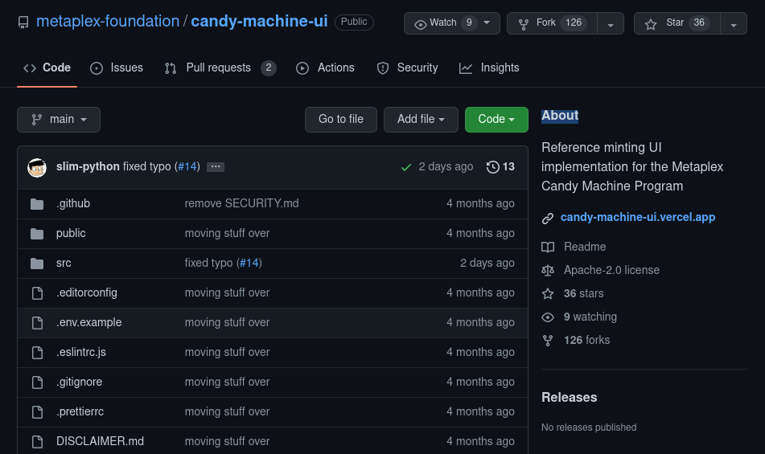
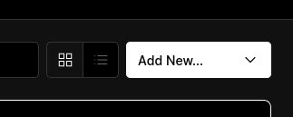
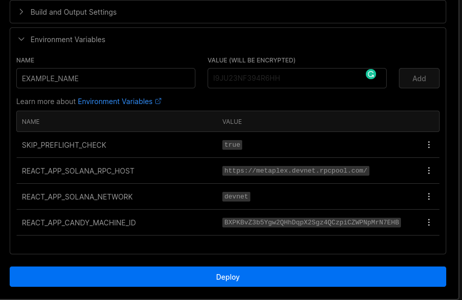
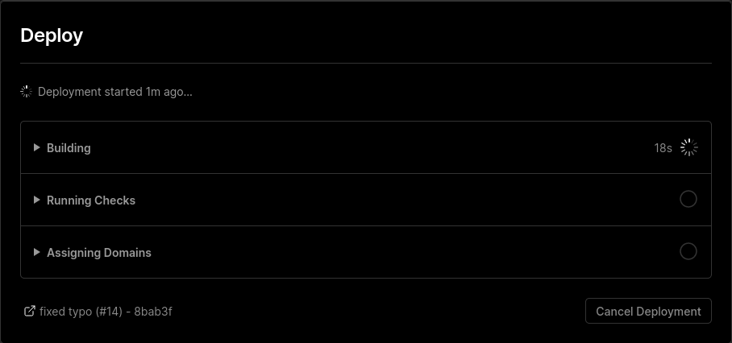
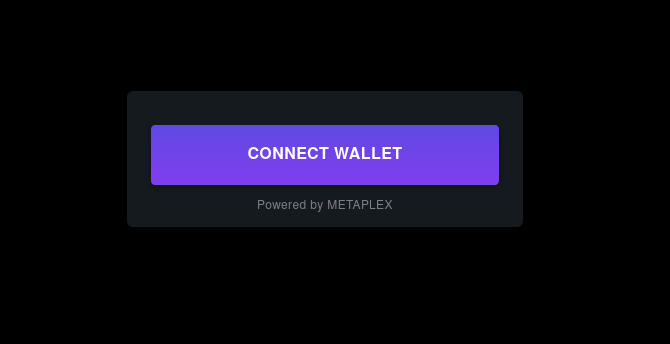

<!-- TODO add screenshots -->
<!-- TODO: Walk through create config but don't dwell too much and add reasurring statement that default options is fine -->
<!-- TODO: use bundlr -->
<!-- TODO: add the .env details -->
# Solana NFT Tutorial

If you're not in Solana, it's time for you be in it, because just recently [Solana overtakes Ethereum in Daily NFT trading volume](https://decrypt.co/101342/solana-overtakes-ethereum-daily-nft-trading-trippin-ape-tribe). This means that you can be certain that NFTs are thriving in Solana.

So if you're looking to figure out how to create [NFTs](https://www.alchemy.com/nfts) with Solana, then you came to the right place.

> Note: If you have any errors or questions, check out the FAQ below.

# Prerequisite
1. [Github Account](https://github.com/)
2. [Vercel Account](https://vercel.com/)
3. [Alchemy API Key](https://alchemy.com/?a=solana-nft-tutorial)
5. [Node](https://nodejs.org/en/)(v16.10.0) and [Yarn](https://yarnpkg.com/)

# What you're building...

<!-- TODO: Add node version -->
In this tutorial you will be learning all about Solana NFT Collections. You will start from generating your images and metadata with the art generation tool, HashLips. It will then be followed with the Sugar CLI tool allowing you to deploy your Candy Machine program to facilitate your NFT collection on Solana's devnet. Lastly, you will finally deploy your NFT minting application to production with Vercel and manually test its functionality.

<!-- 1. Art and Metadata generation with HashLips -->
<!-- 2. NFT Collection Deployment with Metaplex Sugar CLI and Candy Machine -->
<!-- 3. Minting Dapp Deployment with React and Vercel -->
<!-- 4. Testing -->

# A Guide on CLI Format

For this tutorial I will be placing CLI commands within code blocks like below with `# shell` at the top to indicate that it's a CLI command. I will also denote the output of the command in a separate code block labeled with `# output`.

```sh
# shell
echo "this is a cli command"
```

```sh
# output
this is a cli command
```

# Where we'll work

Using the following commands below, change into your home directory and create a new directory. This will serve as your workspace to isolate your files during this tutorial so change your current directory to your newly created folder.

```sh
# shell
cd ~
mkdir alchemy-solana-nft
cd alchemy-solana-nft
```

If done right you should get a similar output below.
```sh
# shell
pwd
```

```sh
# output
/home/kristian/alchemy-solana-nft
```

# Project Template

In order to make the process of going through the tutorial easier, I have made a template with different folders that will serve as your workspaces and you can get it [over here](https://github.com/alchemyplatform/solana-nft-tutorial).
```
/solana-nft-tutorial
	README.md
	/template
		/0-assets
			/Head
				HotPink#1.png
				Pink#1.png
				Yellow#1.png
			/Mouth
				Frown#1.png
				Smile#1.png
				Shock#1.png
			/Eyes
				Circular#1.png
				Oval#1.png
				Wonky#1.png
		/1-generate
		/2-build
		/3-deploy
```

Each folder would correspond to a different workspace for cloning, installing, generating, and deploying.

# Solana Tool Suite

### Installation

Before we jump into building our NFT collection we must first install Solana's suite of tools by following [this guide](https://docs.solana.com/cli/install-solana-cli-tools).

Upon installing, make sure that it's properly installed by running the command below:

```sh
# shell
solana --version
```

You must receive a similar output below:
```sh
# output
solana-cli 1.10.24 (src:15456493; feat:2982808786)
```

### Basic Usage

Solana's tool suite is designed to have [multiple commands](https://docs.solana.com/cli/conventions) we can use to deploy our NFT collection. However, for this tutorial we will only go through the crucial steps that you need in order to get started.

> **WARNING**: The first thing you should always do is configure your Solana work environment to make sure you don't deploy, use some of your Solana.

#### Quick list

`solana --version` - get the current version of the Solana tool suite installed

`solana config get` - get the current Solana tool suite configuration.

`solana config set` - set the current Solana tool suite configuration.

`solana-keygen new` - create a new filesystem keypair.

`solana airdrop <amount> <address>` - airdrop some devnet / testnet Solana in a certain address.

#### First Steps

The first thing you will be doing when you first install Solana is to test whether it's installed properly with `solana --version`.

The next thing you should **always do** is to check the current configuration of your Solana tool suite with `solana config get`.

```sh
# shell
solana config get
```

You should receive an output similar to the one below. The key things to look out for are the `RPC URL` and your `Keypair Path`. These 2 are the ones you will most likely change in order to do some testing.
```sh
# output
Config File: /home/kirby/.config/solana/cli/config.yml
RPC URL: https://api.mainnet-beta.solana.com
WebSocket URL: wss://api.mainnet-beta.solana.com/ (computed)
Keypair Path: /home/kirby/.config/solana/id.json
Commitment: confirmed
```

Notice that the configuration above is in `mainnet-beta`. In order for us to do some testing, we must change this to `devnet`.

```sh
# shell
solana config set --url devnet
```

You should get a similar output below.
```sh
# output
Config File: /home/kirby/.config/solana/cli/config.yml
RPC URL: https://api.devnet.solana.com
WebSocket URL: wss://api.devnet.solana.com/ (computed)
Keypair Path: /home/kirby/.config/solana/id.json
Commitment: confirmed
```

Now you're done getting ready for development!

# Generating Assets with HashLips

### Setup
Now that you're done installing Solana's tool suite, it's time to generate some  assets with **HashLips**.

HashLips is an art generation tool that can be used to layer images on top of each other depending on your own configuration. It's a tool that's mainly used for generative art collections in Solana.

In order to get started get a copy of [our template here](https://github.com/alchemyplatform/solana-nft-tutorial) and clone it locally with the command below.

```sh
# shell
# current directory: /home/kristian/alchemy-solana-nft
git clone https://github.com/alchemyplatform/solana-nft-tutorial
```

You should receive directory structure similar to below with the pre-made layer images we will be using for the art generation we will be doing with HashLips.
```
/solana-nft-tutorial
	README.md
	/template
		/0-assets
			/Head
				HotPink#1.png
				Pink#1.png
				Yellow#1.png
			/Mouth
				Frown#1.png
				Smile#1.png
				Shock#1.png
			/Eyes
				Circular#1.png
				Oval#1.png
				Wonky#1.png
		/1-generate
		/2-build
		/3-deploy
```

Change directory into `1-generate` and this will serve as your workspace for generating your art.
```sh
# shell
# current directory: /home/kristian/alchemy-solana-nft
cd alchemy-solana-nft/template/1-generate
```

Once in `1-generate` let's get a copy of [HashLips and install it locally](https://github.com/HashLips/hashlips_art_engine).
```sh
# shell
# current directory: /home/kristian/alchemy-solana-nft/template/1-generate
git clone https://github.com/HashLips/hashlips_art_engine.git
cd hashlips_art_engine
```

Go to the root of the newly cloned repository and install the dependencies.
```sh
# shell
# current directory: /home/kristian/alchemy-solana-nft/template/1-generate/hashlips_art_engine
yarn install # yarn
npm install # npm
```

### Usage

HashLips is a very powerful art engine that allows you to create different configurations for your art generation, but for this tutorial's purposes **we will keep it as simple as possible**.

After doing the steps above you must be left with a similar set of files.
```sh
# shell
# current directory: /home/kristian/alchemy-solana-nft/template/1-generate/hashlips_art_engine
ls # list files in current directory
```

```sh
# output
# current directory: /home/kristian/alchemy-solana-nft/template/1-generate/hashlips_art_engine
ls # list files in current directory
banner.png  layers    modules       package-lock.json  utils
constants   LICENSE   node_modules  README.md          yarn.lock
index.js    logo.png  package.json  src
```

Change directory into `layers` and remove all the sample files.
```sh
# shell
# current directory: /home/kristian/alchemy-solana-nft/template/1-generate/hashlips_art_engine/
ls # list files in current directory
cd layers
rm -r * # delete all in directory 
```

Copy all of the folders inside `0-assets` in the template into `layers` folder because that's where all of our layers will be placed for art generation using **HashLips**.

After copy and pasting the folders from `0-assets` your `layers` folder should look like the one below.
```
# current directory: /home/kristian/alchemy-solana-nft/template/1-generate/hashlips_art_engine/
/layers
	/Head
		HotPink#1.png
		Pink#1.png
		Yellow#1.png
	/Mouth
		Frown#1.png
		Smile#1.png
		Shock#1.png
	/Eyes
		Circular#1.png
		Oval#1.png
		Wonky#1.png
```

Now go into the `src` folder and modify `config.js` to your needs. For this tutorial we will keep it simple and only modify the necessary ones below:

- `network` 
- `namePrefix` and `description`
- `solanaMetadata`
- `layerConfigurations`

First things first, modify your `network` from `NETWORK.eth` to `NETWORK.sol`.
```js
const network = NETWORK.sol
```

Change your `namePrefix` to the name of your collection. In this case we're calling it **Patrick Head**. Also change `description` to the description of your NFT collection.
```js
const namePrefix = "Patrick Head";
const description = "My Patrick Heads";
// ignore the baseUri variable for now
```

Modify your Solana Token Metadata as needed. If you want to know more about Solana's token metadata standard, you can check the [Metaplex Docs](https://docs.metaplex.com/programs/token-metadata/token-standard).

This is the default Solana metadata in `config.js`.
```js
const solanaMetadata = {
  symbol: "YC",
  seller_fee_basis_points: 1000, // Define how much % you want from secondary market sales 1000 = 10%
  external_url: "https://www.youtube.com/c/hashlipsnft",
  creators: [
    {
      address: "7fXNuer5sbZtaTEPhtJ5g5gNtuyRoKkvxdjEjEnPN4mC",
      share: 100,
    },
  ],
};
```

Here's a brief overview of the following properties.

- `symbol` is the short representation of the NFT Collection.
- `seller_fee_basis_points` is the percentage of royalty you want to get from the collection's secondary sales.
	- 1000 = 10% royalty
- `external_url` is a URI pointing to an external link defining the asset. (e.g. the project's website)
- `creators` is an array list of addresses with royalty allocation that determines to whom the creators fees are sent to.
	- share number must be <= 100
	- total shares of all creators combined **must be equal to 100**

Let's modify it a bit to fit our collection. Let's make our symbol `PS` and set our creator fees to `1000` basis points (10%). Let's keep the `external_url` to default and **add the creators as needed**.

In this case, since we're just doing a demo, I'll keep the creators as default.

```js
const solanaMetadata = {
  symbol: "PS",
  seller_fee_basis_points: 1000, // Define how much % you want from secondary market sales 1000 = 10%
  external_url: "https://www.youtube.com/c/hashlipsnft",
  creators: [
    {
      address: "7fXNuer5sbZtaTEPhtJ5g5gNtuyRoKkvxdjEjEnPN4mC",
      share: 100,
    },
  ],
};
```

After that, head on over to the `layerConfigurations` variable and copy the one below. The configuration below states the ordering of the asset generation.

The top layer added `{ name: "Head" }` is the first asset to be drawn hence the furthest from the front.

The bottom layer `{ name: "Eyes" }` is the last asset to be drawn hence the nearest to the front.


```js
// If you have selected Solana then the collection starts from 0 automatically
const layerConfigurations = [
  {
    growEditionSizeTo: 27,
    layersOrder: [
      { name: "Head" },
      { name: "Mouth" },
      { name: "Eyes" },
    ],
  },
];
```

Now that you're done with the setup, it's time to build. In order to generate your art, use the command below.

```sh
# shell
yarn run build # yarn
npm run build # npm
```

Upon running your command and waiting for it to finish go in to your `build` folder and there should be a folder for `images` and a folder for `json`. You should expect 27 different PNG files and also 27 different JSON files from your generation.

```sh
# current directory: /home/kristian/alchemy-solana-nft/template/1-generate/hashlips_art_engine
/build
	/images
		0.png
		1.png
		.
		.
		26.png
	/json
		0.json
		1.json
		.
		.
		26.json
```

If all is set  and done you can now start deploying your collection with Metaplex's `Sugar` CLI tool.

# Deploying your Collection

Metaplex built a has a tool called [Sugar](https://docs.metaplex.com/developer-tools/sugar/) that's a CLI tool used for managing your deployed `Candy Machine Program`. The `Candy Machine` is used for minting and distribution of Solana NFTs.

Using `Sugar` will make your deployment and management easier.

### Installation

Run the command below to fetch and install `Sugar`.

```sh
# shell
bash <(curl -sSf https://sugar.metaplex.com/install.sh)
```

Confirm that it was installed correctly.

```sh
# shell
sugar --version
```

```sh
# output
sugar-cli 1.1.0
```

### `sugar` Usage

##### Preparing the Assets
First change directory into `3-build` in the template. This will serve as your workspace for using `sugar` and deploying the collection.

Next create an `assets` directory in the `2-build` folder and copy the images and JSON file from HashLips generation earlier.
<!-- TODO: add exact HASHLIPS folder path -->

After copying the files from our `2-build` directory should look similar to the one below.

```
/solana-nft-tutorial
	** snipped **
	/2-build
		/assets
			_metadata.json
			0.png 0.json
			1.png 1.json
			2.png 2.json
			.
			.
			.
			25.png 25.json
			26.png 26.json
	/3-deploy
```

Notice the `_metadata.json` file? Move it to a different folder to make sure only the images and JSON files are in the asset folder.

##### Collection Mint

Collection mint is the NFT that serves as the "album cover" of your NFT collection in the marketplace. It can be set any valid NFT, but for this tutorial we'll let sugar **automatically detect the  collection mint.**

In order to set the collection mint automatically go into the `assets` folder and copy `0.png` into `collection.png` and `0.json` into `collection.json`.

After removing `_metadata.json` and adding a collection mint your assets directory should be similar to the one below.

```
/solana-nft-tutorial
	** snipped **
	/2-build
		/assets
			collection.png
			collection.json
			0.png 0.json
			1.png 1.json
			2.png 2.json
			.
			.
			.
			25.png 25.json
			26.png 26.json
	/3-deploy
```

Now that your assets are ready, it's time to use `sugar` in order to deploy it.

### Deployment

Before we start make sure you change directory into the `2-build` folder where the `assets` folder is found.

##### Overview

1. `sugar validate` to check if the images and metadata was generated correctly
2. `sugar create-config` to create a **Candy Machine configuration** interactively
2. `sugar upload` to upload your images and metadata (JSON) files to the storage of your choice
3. `sugar launch` to launch your Candy Machine for NFT collection minting
4. `sugar verify` to verify uploaded data
5. `sugar show` to show the details of your launched Candy Machine

##### Step-by-Step

In the `2-build` folder where the `assets` folder is found, run the following commands below.

Validate if the generated images and metadata (JSON) are valid and ready to be deployed.

```sh
# shell
sugar validate
```

You must receive the same output below with a command successful event if your images and metadata are ready for upload.

```sh
# output
[1/1] 🗂  Loading assets
▪▪▪▪▪ Validating 28 metadata file(s)...

Validation complete, your metadata file(s) look good.

✅ Command successful.
```

After validating your generated images and metadata, it's time to interactively create a **Candy Machine** config using `sugar create-config`.

It should walk you through an interactive prompt so feel free to modify it as you wish. After doing that, it's time to upload your collection to storage.

<!-- TODO: Insert success output after config generation for sanity check -->

```sh
# shell
sugar upload
```

If the upload is successful, you should get a similar output below.

```sh
# output
[00:00:00] Upload successful ██████████████████████████████████████████████████ 28/28

28/28 asset pair(s) uploaded.

✅ Command successful.
```

Upon the successful completion of the upload it's time to launch your Candy Machine!

```sh
# shell
sugar launch
```

If you got a **Command Succesful** response, you're almost done!

Do a quick `sugar verify` followed by a `sugar show` to check the status of your launched Candy Machine and check for a **Command Successful** response.

```sh
# shell
sugar verify
sugar show # check details of deployed Candy Machine
```

Take note of the **Candy Machine ID**. You'll use it for deploying the frontend.

**Congratulations! You're done!** with deploying your Candy Machine! It's time to use Metaplax's Candy Machine template to mint your NFTs!

# Deploy Minting Website

In this tutorial we will be using Vercel and **Metaplex's Candy Machine UI** in order to create a minting dapp for our newly deployed collection.

First, go to Metaplex's [Candy Machine UI](https://github.com/metaplex-foundation/candy-machine-ui) repository and fork it.



After forking it go to [Vercel](https://vercel.com/) login and add new **Project** and **Continue with Github**. Choose your own fork of the **Candy Machine UI**. 



##### Configure Environment Variables

Check your fork and open `.env.example` use it to configure your Vercel Environment Variables.

<!-- TODO: ADD COPYABLE .ENV FILE -->

> Tip: Don't know where to find the Candy Machine Program ID? Use `sugar show` and copy Candy Machine ID.



After configuring it's time to deploy and **view your site**!




A webpage should open like the one below. Connect your wallet and try minting one to test your Candy Machine deployment.



# Testing

Now it's time to test your newly deployed collection using your Minting DApp on Vercel.

First get your devnet Solana (SOL) using Solana CLI and with your Phantom wallet address.

> You can only request a maximum of 2 SOL at a time.

```sh
# shell
solana airdrop 2 **insert wallet address here**
```

After getting your Devnet SOL, it's time to finally try your Minting Dapp by connecting your wallet and minting your first Devnet NFT!
<!-- TODO: Add photo here -->

### What else moving forward...

NFTs can have a lot of utilities and a simple collection that you've just deployed is just the start. If you want to know more and find more ways to use Solana NFTs as well as to add utilities to them learn from the following resources below:
<!-- TODO: Insert resources bullet list -->
<!-- - art generation tips -->
<!-- - how to go to mainnet -->
<!-- - examples of cool NFT projects / functions on solana -->
<!-- - blog post that people made on giving solana NFTs utility -->

### That's it! You're done! Glad you reached this point now you're ready to conquer the world of Solana NFTs!

### Frequently Asked Questions (FAQs)
<!-- TODO: add node version error from notion -->
